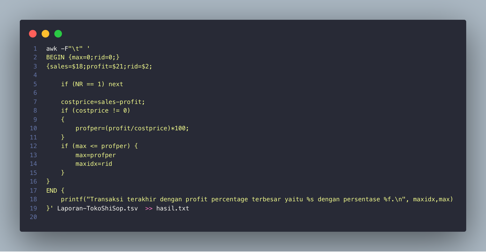
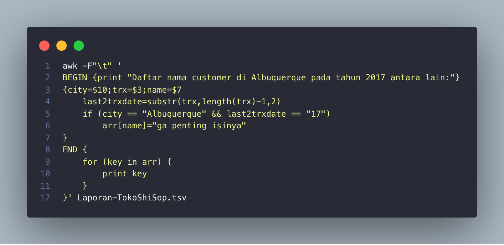
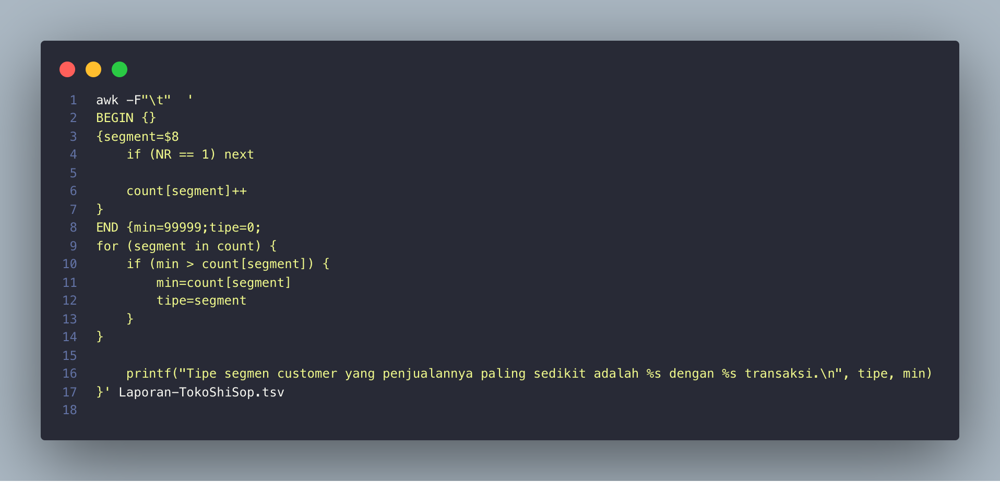
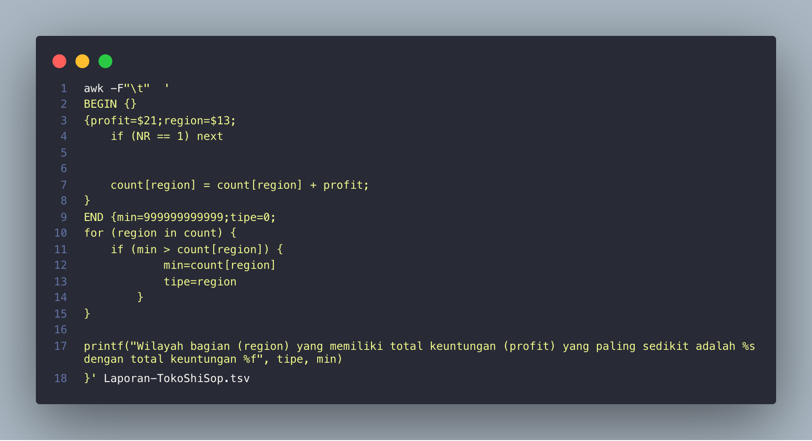

# Soal Shift 1
[Soal](https://docs.google.com/document/d/1T3Y4o2lt5JvLTHdgzA5vRBQ0QYempbC5z-jcDAjela0/edit)


## Soal Nomor 2
#### Source Code 2a


#### Cara Pengerjaan
1. Menggunakan `awk -F"\t"` untuk memisahkan file tsv(tab separated value)
2. Kemudian, pada block begin. Kami menyimpan value `max` dan `rid` untuk menyimpan Profit Percentage dan Order ID
3. Pada code block Body, yang dilakukan adalah dengan menghitung costprice sesuai rumus, kemudian mencari profit percentagenya, dilakukan juga if untuk menghindari division by 0.
4. Kemudian, dari `profper` atau profit percentage yang didapat, maka bisa kita cari maximumnya dengan menggunakan if block.
5. block Body akan dilakukan di setiap line, dan akan menyimpan Profit Percentage yang paling besar dan Order ID nya.
6. Kemudian pada block End, kita hanya tinggal mengeluarkan output sesuai format.

#### Kendala
1. Kami mengalami error saat melakukan pembagian dengan 0
   ```bash
    awk: division by zero
    input record number 1, file Laporan-TokoShiSop.tsv
    source line number 6
   ```
2. Awalnya, kami salah meletakkan deklarasi `max` dan `rid` di block Body, sehingga setiap baris maxnya ter-reset, sehingga tidak akan mengeluarkan nilai maksimal.

### Source Code 2b


#### Cara Pengerjaan
1. Pada block Begin, kami mengeluarkan output sesuai dengan format terlebih dahulu.
2. Kemudian pada block Body, kami menggunakan variable `last2trxdate` untuk memilih 2 digit terakhir dari tanggal Order Date sehingga dari yang awalnya `01/01/17` menjadi `17`.
3. Dengan variable tersebut kita bisa menggunakan if dengan kondisi `city=$10` sama dengan nama kota yaitu "Albuquerque", dan `last2trxdate` adalah 17, karena kita ingin mencari yang transaksinya tahun 2017.
4. Kemudian setiap if block tersebut, kita menyimpan nama yang muncul sebagai key array, dengan isi array sembarang
5. Terakhir, pada block End, kami melakukan looping keys yang ada di array, kemudian mengeluarkan keys tersebut sebagai output, karena key yang kita gunakan adalah nama orang. Dengan cara array ini juga, setiap nama tidak muncul lebih dari sekali.

### Kendala
1. Awalnya, kami hanya melakukan print name saja, sehingga 1 nama muncul berkali", kemudian kami mencari cara untuk mengeluarkan hanya sekali saja yaitu dengan array.

#### Source Code 2c


#### Cara Pengerjaan
1. Pada soal ini, karena diminta segmen yang muncul paling sedikit, maka hal pertama yang dilakukan adalah dengan menghitung dulu berapa kali tiap segment muncul. Yaitu dengan menggunakan array `count[segment]`. dengan keys segment. Setiap line, maka akan dicek dan menambah occurence dari segmen.
2. Kemudian kami juga menambahkan `if (NR == 1) next` untuk skip line 1 karena berupa header.
3. Terakhir, pada block End, kami mendeklarasi `min` dan `tipe` untuk menyimpan jumlah occurences terkecil, dan tipe segmennya.
4. Kemudian, kami melakukan looping tiap keys pada array, kemudian mencari nilai terkecil dengan menggunakan if.
5. Setelah looping selesai, maka kita bisa mendapat occurence paling kecil dan nama segmennya, dan mengoutputkannya sesuai format.

#### Kendala
1. Pada soal ini, kendala yang cukup membingungkan karena deklarasi awal di block END, minnya terlalu kecil, sehingga membuat nilai min menjadi salah.
2. Kemudian, sebelum ditambahkan code untuk skip line 1, hasil yang paling minimal adalah occurence headernya, yaitu hanya 1x, maka kami mengimplementasikan code tersebut.


#### Source Code 2d


#### Cara Pengerjaan
1. Untuk soal ini, sebenarnya kurang lebih mirip dengan ketiga soal di atas, tetapi bedanya dalam array soal ini, kami mengumpulkan akumulasi dari profit, sehingga kami menggunakan code `count[region] = count[region] + profit` 
2. Kemudian, setelah setiap total profit dari region terkumpul, terakhir, kita bisa melakukan for loop dengan region sebagai keynya. Kami melakukan if block, untuk mencari total profit yang paling minimum dari semua region. Selain itu, kami juga menyimpan `tipe` yaitu untuk menyimpan nama regionnya.
3. Setelah itu kami mengeluarkan output sesuai dengan formatnya.

#### Kendala
Tidak ada


## Referensi Nomor 1
- read and separated file https://stackoverflow.com/questions/9736202/read-tab-separated-file-line-into-array
- split text file space delimiter https://unix.stackexchange.com/questions/410710/splitting-a-line-into-array-in-bash-with-tab-as-delimiter

## Referensi Nomor 2
- cek cara split tab, nomor 2 https://stackoverflow.com/questions/44394034/how-to-view-syslog-in-ubuntu
- cari max, https://www.programmersought.com/article/4079936922/
- cari substring buat tanggal, https://community.hpe.com/t5/Languages-and-Scripting/print-the-last-character-of-a-string-using-awk/td-p/5162994#.YFoTwmgxXOR
- cari muncul berapa kali https://stackoverflow.com/questions/27986425/using-awk-to-count-the-number-of-occurrences-of-a-word-in-a-column