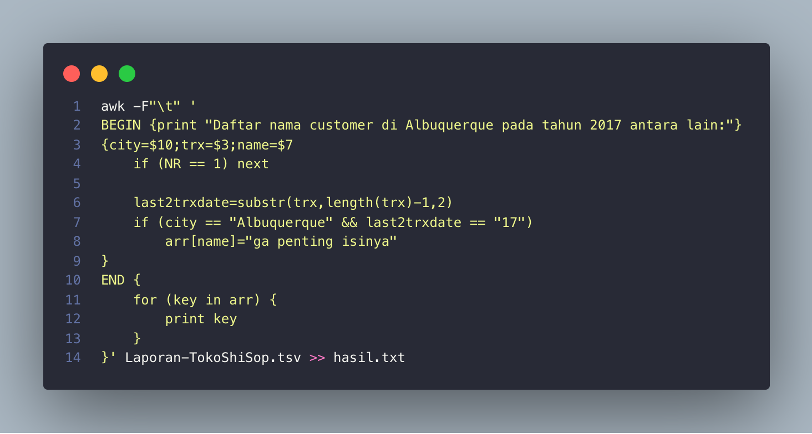
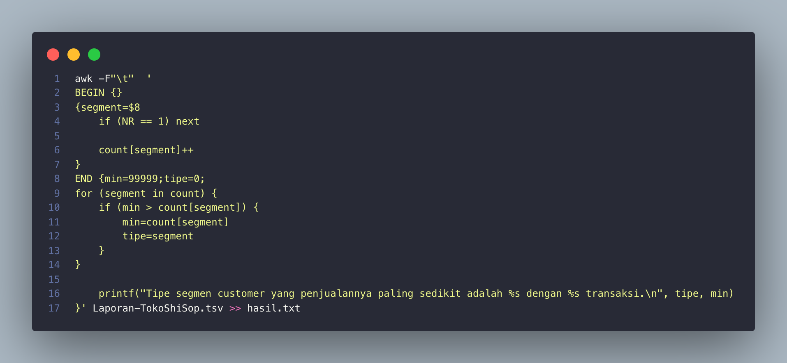
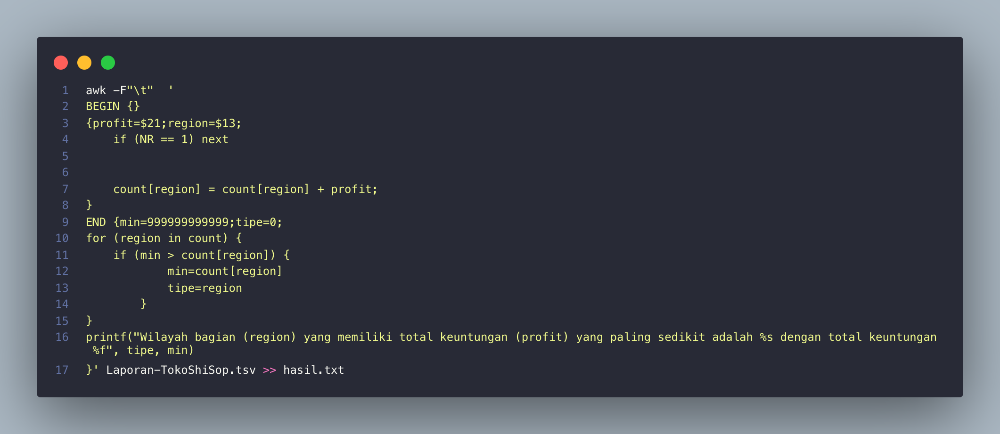

# Soal Shift 1
[Soal](https://docs.google.com/document/d/1T3Y4o2lt5JvLTHdgzA5vRBQ0QYempbC5z-jcDAjela0/edit)
### Soal 1a
#### Cara Pengerjaan
Tujuan: Mengumpulkan informasi berupa: jenis log (`ERROR`/`INFO`), pesan log, dan username pada setiap baris lognya
1. Menggunakan regex `'(ERROR|INFO) .*'`
2. Contoh informasi baris yang terambil: "ERROR Tried to add information to closed ticket (mcintosh)"

### Soal 1b (Perintah 1)

#### Source Code 1b dan 1d (Perintah 1)


#### Cara Pengerjaan
Tujuan: menampilkan semua pesan error yang muncul beserta jumlah kemunculannya
1. Melakukan `grep` pada `syslog.log` untuk mengambil isi log
2. Menggunakan regex dengan `'(ERROR) .* '` untuk mengambil baris yang mengandung tulisan `(ERROR)`
3. Menggunakan tambahan `-o` untuk mencetak hanya yang eksplisit sesuai dengan kondisi yang diminta (bukan seluruh isi baris)
4. Menggunakan `sed s/"ERROR "//` untuk menggantikan kata "ERROR " dengan nilai kosong
5. Diberikan kombinasi `| sort | uniq -c | sort -nr` berturut-turut untuk mengurutkan data berdasarkan kalimat, mengelompokkan serta menghitung jumlah kemunculkan berdasarkan kalimat yang sesuai, dan mengurutkan jumlah kemunculan secara descending atau reverse
6. Dilakukan penyimpanan nilai jumlah kemunculan pesan error dan text error ke dalam variabel 'count' dan 'text' dengan iterasi `| while read count text`

### Soal 1c (Perintah 2)
#### Source Code 1c dan 1e (Perintah 2)

#### Cara Pengerjaan
Tujuan: menampilkan jumlah kemunculan log `ERROR` dan `INFO` untuk setiap usernya
1. Melakukan grep pada `syslog.log` untuk mengambil isi log
2. Menggunakan regex dengan `'.* (\(.*\))'` Untuk mengambil seluruh baris
3. Menggunakan tambahan `-o` untuk mencetak hanya yang eksplisit sesuai dengan kondisi yang diminta (bukan seluruh isi baris)
4. Menggunakan `sed  's/.*(\(.*\))/\1/'`  untuk mengganti seluruh isi dengan nilai yang ada diantara bracket `()`. Caranya dengan menyimpan nilai yang ada di antara escaped bracket `\(` dan `\)` dan mengakses yang disimpan dengan `\1` (referensi: get string inside parenthesis https://unix.stackexchange.com/questions/108250/print-the-string-between-two-parentheses)
5. Diberikan kombinasi `| sort | uniq -c` untuk mengurutkan informasi yang diambil serta menghitung kemunculan tiap informasi yang serupa
6. Dilakukan penyimpanan nilai jumlah kemunculan pesan info dan parenthese ke dalam variabel 'count' dan 'name' dengan iterasi `| while read count name`
7. Di dalam perulangan tersebut dilakukan perhitungna jumlah kemunculan status `INFO` dan `ERROR` pada user/parenthese `name` terkait dengan berturut-turut disimpan dalam variabel `infoC` dan `errC`
8. Diberikan `grep -oE ".* (INFO) .* (\($name\))"` pada `infoC` dan `grep -oE ".* (ERROR) .* (\($name\))"` pada `errC` untuk mengambil baris yang mengandung `(INFO)` dan `(ERROR)`
9. Menggunakan `sed  's/.*(\(.*\))/\1/'`  untuk menghilangkan selain parentheses seperti langkah no. 4
10. Dilakukan `| wc -l | sed 's/^[ \t]*//'` untuk menghitung jumlah parentheses yang muncul serta menghilangkan tab di depannya

#### Cara Pengerjaan
1. Mencetak Error,Count pada error_massage.csv
2. Di dalam perulangan 1b while read count text, dilakukan `echo $text,$count >> error_message.csv` untuk menuliskan nilai 'count' dan 'text' di file error_massage.csv
3. Pengurutan jumlah kemunculan sudah teratasi oleh `sort` sebelumnya

#### Cara Pengerjaan
1. Menuliskan Username,INFO,ERROR pada user_statistic.csv
2. Di dalam perulangan 1c while read count name, dilakukan `echo $name,$count,$errC >> user_statistic.csv` untuk menuliskan nilai 'name', 'count' dan 'errC' di file user_statistic.csv
3. Pengurutan jumlah kemunculan sudah teratasi oleh `sort` sebelumnya


### Kendala
- Kesulitan mencari referensi untuk pengelempokan sebelum menemukan uniq -c
- Pada nomor 1b, salah melakukan sorting sehingga jawaban tidak sesuai yang diinginkan. Hal ini diatasi dengan cara menambahkan persyaratan `sort -nr`
- Pada nomor 1b, kesulitan untuk menggabungkan pengelompokan 2 parameter berdasarkan `ERROR` dan `INFO`
- Pada nomor 1c, ada beberapa akun yang belum muncul informasinya karena pada sebelumnya dilakukan pendekatan perhitungan dari data status `INFO` lalu baru data status `ERROR`. Hal ini teratasi dengan mengubah pendekatan dari list data user lalu langsung masuk ke kedua status
- Kesulitan mencari referensi untuk mengambil pesan pada user tertentu

---
## Soal Nomor 2
#### Source Code 2a


#### Cara Pengerjaan
1. Menggunakan `awk -F"\t"` untuk memisahkan file tsv(tab separated value)
2. Kemudian kami juga menambahkan `if (NR == 1) next` untuk skip line 1 karena berupa header.
3. Kemudian, pada block begin. Kami menyimpan value `max` dan `rid` untuk menyimpan Profit Percentage dan Order ID
4. Pada code block Body, yang dilakukan adalah dengan menghitung costprice sesuai rumus, kemudian mencari profit percentagenya, dilakukan juga if untuk menghindari division by 0.
5. Kemudian, dari `profper` atau profit percentage yang didapat, maka bisa kita cari maximumnya dengan menggunakan if block.
6. block Body akan dilakukan di setiap line, dan akan menyimpan Profit Percentage yang paling besar dan Order ID nya.
7. Kemudian pada block End, kita hanya tinggal mengeluarkan output sesuai format.

#### Kendala
1. Kami mengalami error saat melakukan pembagian dengan 0
   ```bash
    awk: division by zero
    input record number 1, file Laporan-TokoShiSop.tsv
    source line number 6
   ```
2. Awalnya, kami salah meletakkan deklarasi `max` dan `rid` di block Body, sehingga setiap baris maxnya ter-reset, sehingga tidak akan mengeluarkan nilai maksimal.

### Source Code 2b


#### Cara Pengerjaan
1. Pada block Begin, kami mengeluarkan output sesuai dengan format terlebih dahulu.
2. Kemudian kami juga menambahkan `if (NR == 1) next` untuk skip line 1 karena berupa header.
3. Kemudian pada block Body, kami menggunakan variable `last2trxdate` untuk memilih 2 digit terakhir dari tanggal Order Date sehingga dari yang awalnya `01/01/17` menjadi `17`.
4. Dengan variable tersebut kita bisa menggunakan if dengan kondisi `city=$10` sama dengan nama kota yaitu "Albuquerque", dan `last2trxdate` adalah 17, karena kita ingin mencari yang transaksinya tahun 2017.
5. Kemudian setiap if block tersebut, kita menyimpan nama yang muncul sebagai key array, dengan isi array sembarang.
6. Terakhir, pada block End, kami melakukan looping keys yang ada di array, kemudian mengeluarkan keys tersebut sebagai output, karena key yang kita gunakan adalah nama orang. Dengan cara array ini juga, setiap nama tidak muncul lebih dari sekali.

### Kendala
1. Awalnya, kami hanya melakukan print name saja, sehingga 1 nama muncul berkali", kemudian kami mencari cara untuk mengeluarkan hanya sekali saja yaitu dengan array.

#### Source Code 2c


#### Cara Pengerjaan
1. Pada soal ini, karena diminta segment yang muncul paling sedikit, maka hal pertama yang dilakukan adalah dengan menghitung dulu berapa kali tiap segment muncul. Yaitu dengan menggunakan array `count[segment]`. dengan keys segment. Setiap line, maka akan dicek dan menambah occurence dari segmen.
2. Kemudian kami juga menambahkan `if (NR == 1) next` untuk skip line 1 karena berupa header.
3. Terakhir, pada block End, kami mendeklarasi `min` dan `tipe` untuk menyimpan jumlah occurences terkecil, dan tipe segmennya.
4. Kemudian, kami melakukan looping tiap keys pada array, kemudian mencari nilai terkecil dengan menggunakan if.
5. Setelah looping selesai, maka kita bisa mendapat occurence paling kecil dan nama segmennya, dan mengoutputkannya sesuai format.

#### Kendala
1. Pada soal ini, kendala yang cukup membingungkan karena deklarasi awal di block END, minnya terlalu kecil, sehingga membuat nilai min menjadi salah.
2. Kemudian, sebelum ditambahkan code untuk skip line 1, hasil yang paling minimal adalah occurence headernya, yaitu hanya 1x, maka kami mengimplementasikan code tersebut.


#### Source Code 2d


#### Cara Pengerjaan
1. Untuk soal ini, sebenarnya kurang lebih mirip dengan ketiga soal di atas, tetapi bedanya dalam array soal ini, kami mengumpulkan akumulasi dari profit, sehingga kami menggunakan code `count[region] = count[region] + profit` 
2. Kemudian, setelah setiap total profit dari region terkumpul, terakhir, kita bisa melakukan for loop dengan region sebagai keynya. Kami melakukan if block, untuk mencari total profit yang paling minimum dari semua region. Selain itu, kami juga menyimpan `tipe` yaitu untuk menyimpan nama regionnya.
3. Setelah itu kami mengeluarkan output sesuai dengan formatnya.

#### Kendala
Tidak ada

## Soal Nomor 3
#### Source Code 3a


#### Cara Pengerjaan
1. Pada soal ini menggunakan `wget --content-disposition` untuk menyimpan gambar yang sudah di download dengan label asli dari website sehingga mempermudah dalam pencarian duplikasi.
2. `--content-disposition` adalah command untuk mendownload file, dengan nama asli dari URL Redirect. Karena, jika kita tidak menambahkan, maka yang terdownload adalah kitten.jpg
3. Karena ketika terjadi duplikasi, misal: 5514234_sfaa.jpg, duplikatnya akan menambah suffix nomor seperti 5514234_sfaa.jpg.1, maka kami menggunakan command `rm *.jpg.*` untuk menghapus foto yang duplikat dengan tetap menyisakan foto awal.
4. Kemudian log dari download tersebut di store ke `Foto.log` dengan command `-a 'Foto.log'`.
5. Kami menggunakan `find -name "*.jpg"` pada saat loop untuk pemberian nama bertujuan untuk menemukan file foto yang sudah didownload.
6. Pada command find, ditambahkan juga `! -name "Koleksi*.jpg" untuk mengexclude file kucing yang sudah direname sebelumnya.
7. Kemudian ditambahkan juga command `-print0` untuk memberikan nilai nul pada tiap findings.
8. Kami menggunakan command `while read -d $'\0' file`, untuk melakukan looping dengan delimiter nul.
9. Kemudian kami mengubah nama file yang di looping secara ascending.
#### Kendala
1. Di awal kami kesulitan menemukan metode pengambilan foto tanpa ada duplikasi.

#### Source Code 3b


#### Cara Pengerjaan
1. Pada soal ini dengan prinsip yang sama dengan soal sebelumnya tetapi dengan memindahkan file yang didownload ke dalam folder dengan label tanggal saat dijalankan dengan format berikut`"$(date +%d-%m-%Y)"` dan juga memberikan jadwal menggunakan crontab.
2. Untuk merename file yang sudah didownload kami menggunakan command `find . -name "*.jpg" ! -name "Koleksi*.jpg"` untuk mencari file yang berekstensi .jpg tapi tidak memilih yang sudah ada format Koleksi* sehingga file yang didownload sebelumnya tidak ter-rename.
3. Kemudian, untuk memindahkan file ke folder yang sudah diberi nama sesuai aturan, kami menggunakan `cp *.jpg $dirname` untuk menghindari memindahkan file jpg yang sudah berada di dalam folder, karena pada command `cp` kami tidak menggunakan `-r`.
4. Terakhir, kami meremove foto yang ada di base folder, dan memindahkan Foto.log

#### Kendala
1. Pada saat pemindahan foto ke folder baru, foto di folder lama ikut dalam pemindahan karena metode pencarian juga sampai subfolder sehingga dibutuhkan syarat baru.

#### Source Code 3c


#### Cara Pengerjaan
1. Kami melakukan penghitungan kemunculan folder Kucing dan Kelinci dengan menggunakan conmmand `ls | grep -E 'Kucing_*' | wc -l`.
2. Kemudian kami memandingkan `$kucCount -ge $kelCount` atau `$kucCount >= $kelCount` untuk menjadi acuan pemilihan kucing/kelinci untuk di download di web url yang berbeda sehingga apabila sebelumnya sudah ada folder berisi kucing maka folder selanjutnya akan download di url kelinci. 
3. Untuk pemilihan tersebut maka kami menggunakan variabel `eng` untuk menyimpan url, dan `ind` untuk menyimpan nama.
4. Dengan logika pemilihan tersebut, maka kita bisa mendownload dan merename sesuai dengan ketentuan yaitu bergantian.

#### Kendala
1. Tidak ada kendala.

#### Source Code 3d


#### Cara Pengerjaan
1. Untuk melakukan zip tetapi dengan password yang sudah ditentukan sesuai dengan tanggal disaat mengeksekusi program menggunakan `-e -P $(date +%m%d%Y)` yaitu mengencrypt dengan password yang sesuai dengan tanggal saat program dieksekusi dengan label `Koleksi.zip`.
2. Command `-r` berarti melakukan Zip secara recursive sampai ke file di dalam foldernya
3. Kami menggunakan `rm -r */` untuk menghapus semua folder yang sudah terkompresi ke dalam zip.
4. Pada bash ini, kami juga melakukan pengecekan jam dengan `date +%H` yaitu pada jam 7 untuk melakukan compress, dan pada jam 18 melakukan uncompress dengan command `unzip -P $(date +%m%d%Y) Koleksi.zip`, dan meremove file Koleksi.zip

#### Kendala
1. Di awal mengalami kesulitan untuk melakukan zip sekaligus menghapus file yang sudah dizip ataupun sebaliknya

#### Source Code 3e

#### Cara Pengerjaan
1. Melakukan sesuai jadwal dan dengan memberikan branch pada saat pukul 7 dan 18 untuk melakukan zip atau melakukan unzip.


## Referensi Nomor 1
- read and separated file https://stackoverflow.com/questions/9736202/read-tab-separated-file-line-into-array
- split text file space delimiter https://unix.stackexchange.com/questions/410710/splitting-a-line-into-array-in-bash-with-tab-as-delimiter
- Remove word with sed https://unix.stackexchange.com/questions/311758/remove-specific-word-in-variable
- Custom format output uniq https://stackoverflow.com/questions/8948975/how-do-you-do-custom-formatting-with-the-uniq-c-option
- get string inside parenthesis https://unix.stackexchange.com/questions/108250/print-the-string-between-two-parentheses
- sort count uniq https://stackoverflow.com/questions/11959867/how-to-use-uniq-cd-in-bash-scripting-and-extract-only-the-count-and-not-the-lin

## Referensi Nomor 2
- cek cara split tab, nomor 2 https://stackoverflow.com/questions/44394034/how-to-view-syslog-in-ubuntu
- cari max, https://www.programmersought.com/article/4079936922/
- cari substring buat tanggal, https://community.hpe.com/t5/Languages-and-Scripting/print-the-last-character-of-a-string-using-awk/td-p/5162994#.YFoTwmgxXOR
- cari muncul berapa kali https://stackoverflow.com/questions/27986425/using-awk-to-count-the-number-of-occurrences-of-a-word-in-a-column

## Referensi Nomor 3
- get redirected url https://stackoverflow.com/questions/11389933/how-to-fix-wget-download-file-name-when-the-url-is-redirected
- dont download if file exist wget https://stackoverflow.com/questions/4944295/skip-download-if-files-exist-in-wget
- Loop through file name https://stackoverflow.com/a/9612114
